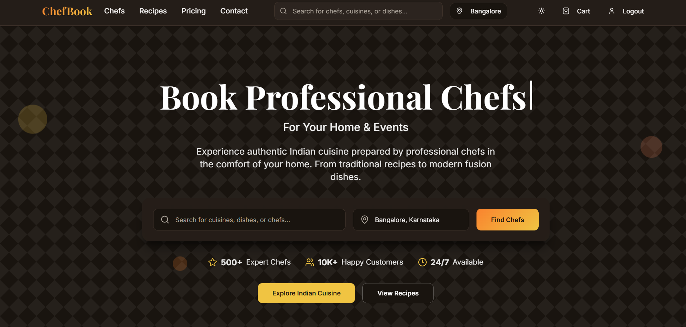
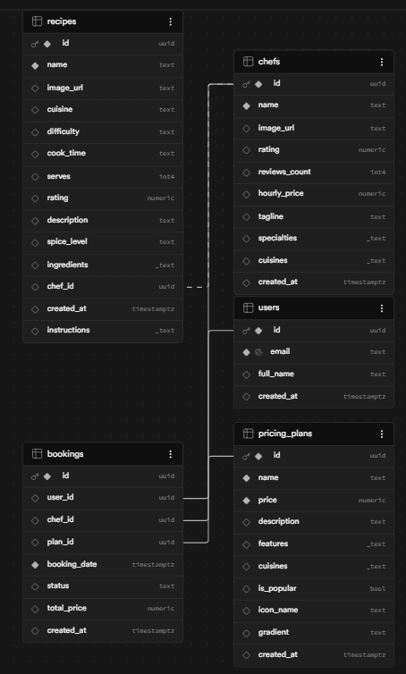

# Project Report: ChefBook - Culinary Booking & Recipe Management System

<div align="center">
  <h2>NITTE | NMAM INSTITUTE OF TECHNOLOGY</h2>
  <p>(Deemed to be University)</p>
  <p>Nitte (DU) established under Section 3 of UGC Act 1956 | Accredited with "A+" Grade by NAAC</p>
  <hr>
  <h3>Department of Computer Science & Engineering</h3>
  <br><br>
  <p>Report on Mini Project</p>
  <h1>CHEFBOOK: CULINARY HUB & BOOKING SYSTEM</h1>
  <br>
  <p>Course Code: CS2102-1</p>
  <p>Course Name: Database Management Systems</p>
  <br>
  <p>Semester: IV SEM &nbsp;&nbsp;&nbsp;&nbsp;&nbsp;&nbsp;&nbsp;&nbsp; Section: A</p>
  <br><br>
  <strong>Submitted To:</strong><br>
  <p>Ms. Ankitha A Nayak</p>
  <p>Course Instructor (DBMS)</p>
  <p>Department of Computer Science and Engineering</p>
  <br><br>
  <strong>Submitted By:</strong><br>
  <p>Aditya Kumar Jha (USN: NNM24CS018)</p>
  <p>Aditya Prakash (USN: NNM24CS019)</p>
  <p>Ahammad Adnan (USN: NNM24CS021)</p>
  <br><br>
  <strong>Date of submission:</strong> 23rd April, 2026
</div>

<div style="page-break-after: always;"></div>

## INSTITUTION CERTIFICATE

This is to certify that the mini-project entitled **"ChefBook: Culinary Hub & Booking System"** has been successfully carried out by **Aditya Kumar Jha (NNM24CS018), Aditya Prakash (NNM24CS019), and Ahammad Adnan (NNM24CS021)**, students of Semester IV, Section A, under the Department of Computer Science & Engineering, NMAM Institute of Technology, as part of the Database Management Systems (CS2102-1) course curriculum.

The work presented in this report is original and meets the established academic standards. They have successfully demonstrated their understanding of the theoretical concepts by implementing them into a functional database management application.

<br><br><br>
___________________________&nbsp;&nbsp;&nbsp;&nbsp;&nbsp;&nbsp;&nbsp;&nbsp;&nbsp;&nbsp;&nbsp;&nbsp;&nbsp;&nbsp;&nbsp;&nbsp;&nbsp;&nbsp;&nbsp;&nbsp;&nbsp;&nbsp;&nbsp;&nbsp;&nbsp;&nbsp;&nbsp;&nbsp;&nbsp;&nbsp;&nbsp;&nbsp;&nbsp;&nbsp;&nbsp;&nbsp;&nbsp;&nbsp;&nbsp;&nbsp;&nbsp;&nbsp;&nbsp;&nbsp;&nbsp;&nbsp;&nbsp;&nbsp;&nbsp;&nbsp;___________________________  
**Ms. Ankitha A Nayak**&nbsp;&nbsp;&nbsp;&nbsp;&nbsp;&nbsp;&nbsp;&nbsp;&nbsp;&nbsp;&nbsp;&nbsp;&nbsp;&nbsp;&nbsp;&nbsp;&nbsp;&nbsp;&nbsp;&nbsp;&nbsp;&nbsp;&nbsp;&nbsp;&nbsp;&nbsp;&nbsp;&nbsp;&nbsp;&nbsp;&nbsp;&nbsp;&nbsp;&nbsp;&nbsp;&nbsp;&nbsp;&nbsp;&nbsp;&nbsp;&nbsp;&nbsp;&nbsp;&nbsp;&nbsp;&nbsp;&nbsp;&nbsp;&nbsp;&nbsp;&nbsp;&nbsp;&nbsp;&nbsp;&nbsp;&nbsp;&nbsp;&nbsp;&nbsp;&nbsp;&nbsp;**Head of Department**  
Course Instructor (DBMS)&nbsp;&nbsp;&nbsp;&nbsp;&nbsp;&nbsp;&nbsp;&nbsp;&nbsp;&nbsp;&nbsp;&nbsp;&nbsp;&nbsp;&nbsp;&nbsp;&nbsp;&nbsp;&nbsp;&nbsp;&nbsp;&nbsp;&nbsp;&nbsp;&nbsp;&nbsp;&nbsp;&nbsp;&nbsp;&nbsp;&nbsp;&nbsp;&nbsp;&nbsp;&nbsp;&nbsp;&nbsp;&nbsp;&nbsp;&nbsp;&nbsp;&nbsp;&nbsp;&nbsp;&nbsp;&nbsp;&nbsp;&nbsp;&nbsp;&nbsp;&nbsp;&nbsp;&nbsp;&nbsp;&nbsp;&nbsp;Computer Science & Engg.  

<br>
**Date:** 23rd April 2026  
**Place:** Nitte  

<div style="page-break-after: always;"></div>

## ABSTRACT

The dynamic evolution of the food and dining industry has created a vast demand for streamlined platforms bridging culinary experts with food enthusiasts. Introducing "ChefBook: Culinary Hub & Booking System," modern web-based software architected to organize and reserve professional chefs and browse master recipes. The platform eliminates the gap between amateur home cooks exploring rich recipes and users organizing gatherings and searching to hire authentic professional chefs based on regional delicacies and specialties.

This mini-project highlights a robust Relational Database Management System developed utilizing Supabase (PostgreSQL), enforcing complex entity relationships and data integrity. ChefBook manages the users' identities, extensive chef profiles with reviews, tailored pricing plans, a deep catalog of recipes, and an intelligent state-based booking tracker. The integration guarantees scalability, security, and exceptional performance using modern backend paradigms and standard RDBMS rules.

<div style="page-break-after: always;"></div>

## ACKNOWLEDGEMENT

The success and final outcome of this project required a lot of guidance and assistance from many people, and we are extremely privileged to have got this all along the completion of our project. All that we have done is only due to such supervision and assistance.

We profoundly thank our course instructor, **Ms. Ankitha A Nayak**, for her continuous guidance, scholarly inputs, and constructive feedback throughout the course of this database management mini-project.

We express our gratitude to the **Department of Computer Science & Engineering, NMAM Institute of Technology (NITTE)**, for providing us with the necessary computing resources, infrastructure, and a conducive environment for technical innovation.

Finally, we would like to extend our warm appreciation to all our peers and family for their unceasing encouragement and moral support.

<div style="page-break-after: always;"></div>

## TABLE OF CONTENTS

1. [Introduction](#1-introduction)
2. [Problem Statement](#2-problem-statement)
3. [Objectives](#3-objectives)
4. [Technologies Used](#4-technologies-used)
5. [Implementation](#5-implementation)
6. [Database Architecture](#6-database-architecture)
7. [Conclusion and Future Scope](#7-conclusion-and-future-scope)
8. [References](#8-references)

<div style="page-break-after: always;"></div>

## 1. INTRODUCTION

The culinary domain is highly decentralized, making it difficult for everyday users to find verified recipes or hire skilled chefs for small gatherings, parties, or customized culinary experiences. The ChefBook project aims to centralize these services through an aesthetic platform optimized for data efficiency and seamless user interactions. Access to high-quality food options goes beyond just food delivery apps—people want chefs to cook exclusively in their homes using premium services.

In parallel to chef bookings, culinary education is strongly advocated. Users can browse a heavily curated list of authentic recipes, filtering them by spice level, cook time, difficulty, and cuisine type. Through ChefBook, anyone can immerse themselves into world-class culinary crafts.

<div style="page-break-after: always;"></div>

## 2. PROBLEM STATEMENT

Currently, the process of finding and booking private chefs for events, parties, and customized culinary experiences involves fragmented communication through social media, unverified reviews, and lack of transparency regarding pricing and availability. Furthermore, those seeking detailed, trustworthy recipes from actual chefs lack a unified database that directly connects them with the creators of those recipes. 

Existing solutions fail to:
- Provide an integrated hub for both learning cooking (recipes) and hiring professionals (chefs).
- Manage structured transactional bookings between standard users and chefs.
- Maintain accurate relational datasets mapping chef specialties, user bookings, transparent pricing plans, and diverse recipes.

Therefore, an integrated relational database ecosystem needs to be engineered to systematically record, track, and retrieve this multifaceted data.

<div style="page-break-after: always;"></div>

## 3. OBJECTIVES

1. Design and establish a robust **Relational Database Architecture** implementing ACID properties for data consistency and reliable transaction executions.
2. Develop an autonomous **Booking Management Unit** enforcing strict constraints dynamically allocating resources and altering booking states ('pending', 'confirmed', 'completed', 'cancelled').
3. Create a **Hierarchical Chef and Recipe Repository**, enforcing Foreign Key relations making sure recipes are accurately mapped to the chef authors without data anomalies.
4. Integrate a **Pricing Plans Model** capable of managing hierarchical feature-sets for varied chef capabilities (Standard, Premium, Luxury).
5. Implement seamless **Row Level Security (RLS)** using Supabase standardizations to completely isolate user data and guarantee user-level privacy.

<div style="page-break-after: always;"></div>

## 4. TECHNOLOGIES USED

The ChefBook ecosystem utilizes cutting-edge stack technologies aligned with enterprise application patterns:

**1. Database Layer (Backend Structure):**
* **Supabase:** An open-source Firebase alternative heavily revolving around PostgreSQL. Used as the core Database Management System for rapid data provisioning and real-time streams.
* **PostgreSQL:** The definitive open-source relational database empowering the schema. Employed for its ability to enforce data integrity with complex foreign-key constraints, ENUM data types, Array manipulations, and UUID scaling.

**2. Application Layer (Frontend Interactivity):**
* **React.js & TypeScript:** Utilized to fabricate the dynamic front-end views, ensuring static typing and robust component management.
* **Vite:** Next-generation frontend tooling optimizing the build and local compilation speeds.
* **Tailwind CSS:** A utility-first CSS framework allowing rapid customized styling, responsible for the vibrant aesthetic UI present through ChefBook.

<div style="page-break-after: always;"></div>

## 5. IMPLEMENTATION

The implementation of ChefBook spans systematic integration of the frontend interactions mapped accurately to the backend SQL schemas.

### 5.1 ChefBook Interface Overview

The portal welcomes users with an elegant layout consisting of categorized chefs and meticulously arranged recipes.

*(Below is the Home Interface of the built project)*


### 5.2 Entity Relationship Mapping Constraints

The database's logical structure bridges entities smoothly. Booking reservations connect the users directly to identical plans and chefs enforcing referential integrities.

*(Below is the ER Schema for the internal database constraints)*


<div style="page-break-after: always;"></div>

## 6. DATABASE ARCHITECTURE

The backbone of this application revolves around exactly interconnected, strongly typed tables described formally below:

### 6.1 Users Table
Maintains authentication identity and basic profiles of enrolled individuals.
```sql
CREATE TABLE public.users (
  id uuid NOT NULL DEFAULT gen_random_uuid(),
  email text NOT NULL UNIQUE,
  full_name text,
  created_at timestamp with time zone DEFAULT now(),
  CONSTRAINT users_pkey PRIMARY KEY (id)
);
```

### 6.2 Chefs Table
Catalogs private chefs available for hire along with metadata, reviews, array-based cuisines, and pricing standards.
```sql
CREATE TABLE public.chefs (
  id uuid NOT NULL DEFAULT gen_random_uuid(),
  name text NOT NULL,
  image_url text,
  rating numeric,
  reviews_count integer DEFAULT 0,
  hourly_price numeric,
  tagline text,
  specialties ARRAY,
  cuisines ARRAY,
  created_at timestamp with time zone DEFAULT now(),
  CONSTRAINT chefs_pkey PRIMARY KEY (id)
);
```

### 6.3 Pricing Plans Table
Encapsulates configurable service models connecting to specific culinary features and price margins.
```sql
CREATE TABLE public.pricing_plans (
  id uuid NOT NULL DEFAULT gen_random_uuid(),
  name text NOT NULL,
  price numeric NOT NULL,
  description text,
  features ARRAY,
  cuisines ARRAY,
  is_popular boolean DEFAULT false,
  icon_name text,
  gradient text,
  created_at timestamp with time zone DEFAULT now(),
  CONSTRAINT pricing_plans_pkey PRIMARY KEY (id)
);
```

### 6.4 Recipes Table
The knowledge base of food preparations, referencing the chefs that authored them, categorizing difficulty constraints, and maintaining instructions via textural array schemas.
```sql
CREATE TABLE public.recipes (
  id uuid NOT NULL DEFAULT gen_random_uuid(),
  name text NOT NULL,
  image_url text,
  cuisine text,
  difficulty text CHECK (difficulty = ANY (ARRAY['Easy'::text, 'Medium'::text, 'Hard'::text])),
  cook_time text,
  serves integer,
  rating numeric,
  description text,
  spice_level text CHECK (spice_level = ANY (ARRAY['Mild'::text, 'Medium'::text, 'Spicy'::text])),
  ingredients ARRAY,
  chef_id uuid,
  created_at timestamp with time zone DEFAULT now(),
  instructions ARRAY,
  CONSTRAINT recipes_pkey PRIMARY KEY (id),
  CONSTRAINT recipes_chef_id_fkey FOREIGN KEY (chef_id) REFERENCES public.chefs(id)
);
```

### 6.5 Bookings Table
A transactional ledger implementing foreign key relations across users, chefs, and their pricing plans, keeping track of time, financial aggregation, and processing statuses.
```sql
CREATE TABLE public.bookings (
  id uuid NOT NULL DEFAULT gen_random_uuid(),
  user_id uuid,
  chef_id uuid,
  plan_id uuid,
  booking_date timestamp with time zone NOT NULL,
  status text DEFAULT 'pending'::text CHECK (status = ANY (ARRAY['pending'::text, 'confirmed'::text, 'completed'::text, 'cancelled'::text])),
  total_price numeric,
  created_at timestamp with time zone DEFAULT now(),
  CONSTRAINT bookings_pkey PRIMARY KEY (id),
  CONSTRAINT bookings_user_id_fkey FOREIGN KEY (user_id) REFERENCES public.users(id),
  CONSTRAINT bookings_chef_id_fkey FOREIGN KEY (chef_id) REFERENCES public.chefs(id),
  CONSTRAINT bookings_plan_id_fkey FOREIGN KEY (plan_id) REFERENCES public.pricing_plans(id)
);
```

<div style="page-break-after: always;"></div>

## 7. CONCLUSION AND FUTURE SCOPE

**Conclusion:**
ChefBook successfully establishes a high-performance relational database solution serving the culinary ecosystem. By enforcing robust integrity rules directly at the PostgreSQL layer, the platform prevents booking conflicts, mitigates the risk of fragmented data, and cleanly centralizes independent components. The system allows end-users to effortlessly traverse and interact with interconnected recipes, varied chefs, and precise booking mechanisms.

**Future Scope:**
* **Payment Gateways:** Expanding the booking state transitions to incorporate automated transactional webhook triggers (e.g., Stripe) executing safely when status shifts to "confirmed".
* **Dynamic Search Architecture:** Utilizing Postgres full-text search indexing to perform lightning-fast queries against the large arrays of `ingredients` and `instructions` strings.
* **Geospatial Expansion:** Infusing PostGIS spatial database extenders within PostgreSQL for users to discover localized chefs nearby and optimize physical catering travel logistics.

<div style="page-break-after: always;"></div>

## 8. REFERENCES

1. Elmasri, R., & Navathe, S. B. (2015). *Fundamentals of Database Systems* (7th ed.). Pearson.
2. PostgreSQL Global Development Group. (2024). *PostgreSQL Documentation*. Retrieved from https://www.postgresql.org/docs/
3. Supabase Documentation. (2024). *Supabase: Application Architecture and Row Level Security*. Retrieved from https://supabase.com/docs
4. Silberschatz, A., Korth, H. F., & Sudarshan, S. (2010). *Database System Concepts* (6th ed.). McGraw-Hill.
5. React Community. (2024). *React – A JavaScript library for building user interfaces*. https://reactjs.org/

---
**END OF REPORT**
